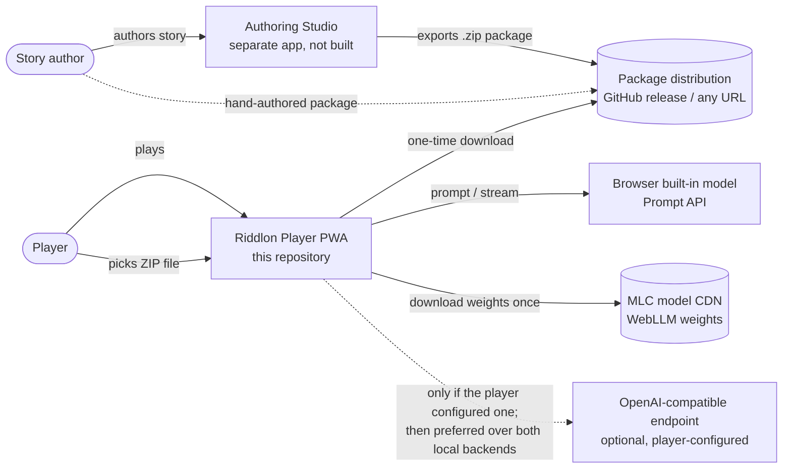

# 3. Context and Scope

## 3.1 Business Context

| Partner                           | Input to Riddlon                                    | Output from Riddlon                                     |
| --------------------------------- | --------------------------------------------------- | ------------------------------------------------------- |
| **Player**                        | Chat messages, profile, imported packages, settings | Character replies, clues, story progress, achievements  |
| **Story author** (indirect)       | A story package (ZIP) via file or URL               | —                                                       |
| **Package distribution**          | ZIP bytes over HTTPS (one-time)                     | An HTTP GET; nothing is sent back                       |
| **Browser built-in model**        | Generated tokens                                    | System prompt + conversation turns, on-device           |
| **MLC model CDN**                 | Model weights and WASM, cached for reuse            | An HTTP GET on first run only                           |
| **Inference endpoint** _(opt-in)_ | Generated tokens                                    | Prompt + turns, plus an API key if the server wants one |

The endpoint is any server speaking `POST /chat/completions` — Ollama, LM Studio, llama.cpp,
vLLM or a hosted provider. When configured it is preferred over both local backends, because it is
most often a server on the player's own machine or network and therefore the stronger model rather
than a compromise. It is inert until the player configures one, so the local path remains the
default experience.

## 3.2 Technical Context

| Interface                  | Technology                                               | Used for                                                                          |
| -------------------------- | -------------------------------------------------------- | --------------------------------------------------------------------------------- |
| Package import (file)      | `<input type="file">` + `fflate` unzip                   | Primary import path; works with no network at all                                 |
| Package import (URL)       | `fetch()` over HTTPS, one-time                           | Convenience path, e.g. a GitHub release asset. Never re-fetched during play       |
| Built-in language model    | W3C / Chrome **Prompt API** (`globalThis.LanguageModel`) | First-choice inference backend; costs no download                                 |
| WebLLM                     | `@mlc-ai/web-llm` over **WebGPU**                        | Second-choice backend; downloads ~1.9 GB of weights once                          |
| Inference endpoint         | Any OpenAI-compatible `/chat/completions` over `fetch`   | First-choice backend when configured; player-supplied address, opt-in             |
| Metadata persistence       | **IndexedDB** (`idb`), database `riddlon`                | Installed packages, character library, savegames, player profile                  |
| Binary persistence         | **Cache Storage** (`riddlon-assets-v1`)                  | Package assets (avatars, covers) content-addressed                                |
| Settings persistence       | **`localStorage`** (`riddlon:*` keys)                    | Disguise mode, notification toggle, active package, model cache markers, endpoint |
| Offline shell              | **Service Worker**, cache-first precache                 | App shell + static assets, including the bundled example package                  |
| Installability             | **Web App Manifest**                                     | Standalone display, icons, theme colour                                           |
| Desktop window integration | **Window Controls Overlay**                              | Drawing the app header into the OS titlebar of an installed desktop app           |

Nothing in this table is a server owned by the project: the two HTTP endpoints are a package
download and a model-weights download, both one-time and both cacheable.

## 3.3 Out of Scope

- The **Authoring Studio** (a separate, not-yet-built application).
- Any **account, sync or multiplayer** feature — there is no server to hold them.
- **Guaranteed background execution or push notifications** for delayed events; see
  [§8.1.6](./08-crosscutting-concepts.md#816-delayed-events) and
  [ADR 12](./09-architecture-decisions.md#adr-12-delayed-events-are-opportunistic-due-dates).
- A **central registry** of character UUIDs shared between users. Reuse is detected locally only.
