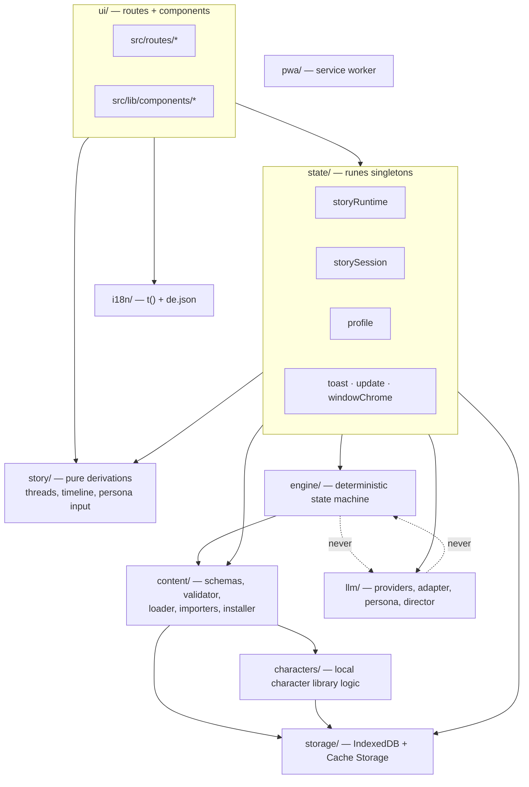

# 5. Building Block View

## 5.1 Level 1 — The Player PWA (whitebox)

| Module        | Directory                          | Responsibility                                                                                       |
| ------------- | ---------------------------------- | ---------------------------------------------------------------------------------------------------- |
| `ui/`         | `src/routes`, `src/lib/components` | Chat interface, contact list, menus, settings. Seven screens plus dev-only harness routes.           |
| `engine/`     | `src/lib/engine`                   | Story state machine: scenes, flags, clues, delayed events, outcomes, progress. No LLM dependency.    |
| `content/`    | `src/lib/content`                  | Package schemas, validator, bundle loader, ZIP and URL importers, installer.                         |
| `characters/` | `src/lib/characters`               | Resolving and installing character identities into the local, story-independent library.             |
| `llm/`        | `src/lib/llm`                      | Provider resolution, session adapter, persona and director prompt building, streaming, capabilities. |
| `storage/`    | `src/lib/storage`                  | IndexedDB stores, content-addressed blob store, data reset.                                          |
| `state/`      | `src/lib/state`                    | Svelte 5 runes singletons — the only reactive layer the UI reads.                                    |
| `story/`      | `src/lib/story`                    | Pure, framework-free derivations from bundle + engine state into display shapes.                     |
| `i18n/`       | `src/lib/i18n`                     | `t()` lookup against `de.json` and `{name}` interpolation. UI chrome only, never story content.      |
| `pwa/`        | `src/service-worker.ts`            | Cache-first shell precache, opt-in update handshake.                                                 |

Two dependency rules are asserted by tests: `engine/` never imports `llm/`
(`engine/no-llm-dependency.spec.ts`), and nothing outside `llm/` imports `@mlc-ai/web-llm`
(`llm/no-backend-leakage.spec.ts`).

## 5.2 Level 2 — `engine/`

A deterministic state machine over one `StoryBundle`. It decides _what may happen_, never _what a
character says_. Every mutating method returns the `EngineEffect[]` it produced; callers observe the
engine through those effects and the read-only queries, never by diffing state.

| Building block                      | Responsibility                                                                                                 |
| ----------------------------------- | -------------------------------------------------------------------------------------------------------------- |
| `engine.ts` — `StoryEngine`         | Facade: `setFlag`, `recordClueClaim`, `resolveClue`, `applyAction`, `resume`, plus read-only progress queries. |
| `state.ts`                          | `EngineState` (plain, JSON-serialisable) and the `EngineEffect` union — the sole contract to the outside.      |
| `conditions.ts`                     | Evaluates the single symbolic condition vocabulary shared by every conditional field in the format.            |
| `actions.ts`                        | Parses and applies the action vocabulary (`unlock-scene:`, `set-flag:`, `unlock-character:`).                  |
| `graph.ts`                          | Recomputes unlocked/completed scenes, reached outcomes, visible and masked characters, progress summary.       |
| `clues.ts`                          | Records per-source clue claims, detects conflicts, resolves clues.                                             |
| `delayed-events.ts` + `duration.ts` | Arms events when their condition holds, fires those whose ISO-8601 delay has elapsed. Firing is sticky.        |
| `persistence.ts`                    | Round-trips `EngineState` through the save store.                                                              |
| `resume.svelte.ts`                  | Calls `resume()` on app open / visibility change.                                                              |

## 5.3 Level 2 — `content/`

Implements the importer / installer / registry split.

| Building block                    | Responsibility                                                                                                                                                                                           |
| --------------------------------- | -------------------------------------------------------------------------------------------------------------------------------------------------------------------------------------------------------- |
| `schemas/*`                       | One Zod schema per format entity; `schemas/common.ts` defines the two id namespaces. The schemas are the format's normative definition.                                                                  |
| `validate-package.ts`             | Whole-package validation: required files, schema shape, format/player version compatibility, duplicate ids, dangling references, character filename/id match.                                            |
| `load-package.ts`                 | Assembles a validated package into the `StoryBundle` the engine consumes. The engine never sees raw files or manifest paths.                                                                             |
| `unzip.ts`                        | ZIP extraction via `fflate`.                                                                                                                                                                             |
| `zip-import.ts` / `url-import.ts` | The two **importers** — a picked file, or a one-time HTTPS download.                                                                                                                                     |
| `install-package.ts`              | The **installer**: validate, store assets content-addressed, resolve character references into the shared library, register in the story registry. Never throws; every failure is a typed `ImportError`. |
| `semver.ts` / `player-version.ts` | Version comparison and the supported format major / current player version.                                                                                                                              |

## 5.4 Level 2 — `llm/`

| Building block                                                                           | Responsibility                                                                                                                                      |
| ---------------------------------------------------------------------------------------- | --------------------------------------------------------------------------------------------------------------------------------------------------- |
| `provider.ts`                                                                            | The **only** file that touches `globalThis.LanguageModel` and the only one that knows all three providers exist. Resolves native → WebLLM → Gemini. |
| `webllm-direct.ts`                                                                       | A hand-written Prompt-API-shaped engine over `@mlc-ai/web-llm`, with one persistent `MLCEngine` reused across sessions.                             |
| `gemini-direct.ts`                                                                       | A Prompt-API-shaped client over the Gemini REST API using plain `fetch`. No SDK, no network on `create()`.                                          |
| `gemini-key.ts`                                                                          | The BYOK key's own `localStorage` module. The key never leaves the device except inside the Gemini request.                                         |
| `adapter.ts`                                                                             | `LlmAdapter` / `LlmSession` — what `state/` codes against. Injects its provider so the real logic is testable in Node with no GPU.                  |
| `catalog.ts`                                                                             | The only place a Riddlon model id maps to a concrete MLC model, its download size, VRAM requirement and context window.                             |
| `capabilities.ts` + `capabilities-rules.ts`                                              | Device probing (WebGPU, buffer limits, metered connection) separated from the pure decisions made from it.                                          |
| `persona.ts`                                                                             | Pure prompt building for one character in one scene, plus `pickResponder()` for group chats.                                                        |
| `director.ts`                                                                            | Pure prompt building and answer parsing for the director pass.                                                                                      |
| `stream.ts`, `turns.ts`, `progress.ts`, `errors.ts`, `model-status.ts`, `model-cache.ts` | Streaming, history windowing, progress mapping, typed error codes, settings-screen status rows, cache markers.                                      |
| `llm.svelte.ts`                                                                          | The `llm` runes singleton the UI reads: status, download progress, which backend won, which models are cached.                                      |

## 5.5 Level 2 — `storage/`

IndexedDB database `riddlon`, version 1, with four object stores plus a separate Cache Storage bucket.

| Building block            | Responsibility                                                                                 |
| ------------------------- | ---------------------------------------------------------------------------------------------- |
| `db.ts`                   | Schema and connection: stores `packages`, `characters`, `saves`, `playerProfile`.              |
| `story-registry.ts`       | Installed packages: manifest, content, cover, size, install time.                              |
| `character-library.ts`    | The local, story-independent character library keyed by character UUID.                        |
| `save-store.ts`           | Savegames: flags, unlocked/completed scenes, clue state, pending delayed events, chat history. |
| `player-profile-store.ts` | The player profile, validated against the package format's `playerProfile` schema.             |
| `blob-store.ts`           | Content-addressed binary assets in Cache Storage (`riddlon-assets-v1`).                        |
| `clear-data.ts`           | Full data reset across all of the above.                                                       |

## 5.6 Level 2 — `state/` and `story/`

`state/` holds the app's reactive layer; `story/` holds the pure functions it is built from. The
split exists so the logic is testable in Node — see
[§8.11](./08-crosscutting-concepts.md#811-state-management).

| Building block                                              | Responsibility                                                                                                                                                                                               |
| ----------------------------------------------------------- | ------------------------------------------------------------------------------------------------------------------------------------------------------------------------------------------------------------ |
| `state/engine.svelte.ts`                                    | `storyRuntime`: one live `StoryEngine` + save per installed package, and every reactive field the UI reads (progress, cast, scenes, threads, clue panels, achievements, outcomes).                           |
| `state/story-session.svelte.ts`                             | `storySession`: chat history per thread, typing state, streaming reply, the contradiction panel, the case-solved overlay, and the send loop.                                                                 |
| `state/profile.svelte.ts`                                   | `profile`: nickname, bio, pronouns, disguise mode, notification toggle.                                                                                                                                      |
| `state/active-package.ts`                                   | Which package is active, persisted under `riddlon:active-package`.                                                                                                                                           |
| `state/onboarding.ts`                                       | First-run versus warm-boot detection.                                                                                                                                                                        |
| `state/reset.ts`                                            | The two "start fresh" actions: savegames only, or everything.                                                                                                                                                |
| `state/toast.svelte.ts`                                     | Transient notifications with auto-dismiss, `persistent` and `dedupeKey`.                                                                                                                                     |
| `state/update.svelte.ts`                                    | Detects a waiting service worker and drives the reload banner.                                                                                                                                               |
| `state/windowChrome.svelte.ts`                              | Live Window Controls Overlay state. Inert outside an installed Chromium desktop app.                                                                                                                         |
| `story/story-display.ts`                                    | Scene timeline, clue panels, achievements, reached outcomes, and `storyThreads()` — folding several scenes with the same character into one solo chat while giving each unlocked group scene its own thread. |
| `story/persona-input.ts`                                    | Composes "this character, in this scene, of this package" into the persona prompt's input.                                                                                                                   |
| `story/library.ts`, `story/types.ts`, `story/boot-steps.ts` | Catalog and bundled-story shapes, the message shape, and the boot sequence's step list.                                                                                                                      |

## 5.7 Level 2 — `ui/`

Seven player-facing screens, each its own route, plus three dev-only harness routes.

| Route                                   | Screen                                                                                                           |
| --------------------------------------- | ---------------------------------------------------------------------------------------------------------------- |
| `/`                                     | Splash and boot sequence, then auto-navigation to `/chats`                                                       |
| `/chats`                                | Chat overview / thread list                                                                                      |
| `/chat?thread=<key>`                    | Solo or group conversation — one shared shell. The key is a character UUID (solo) or scene UUID (group)          |
| `/chat/riddlon`                         | The "Riddlon" system chat: installed-story library plus ZIP and URL import                                       |
| `/story`                                | Storyübersicht — chapter timeline, clues, achievements                                                           |
| `/settings`                             | Profile and settings                                                                                             |
| `/dev/llm`, `/dev/import`, `/dev/story` | Dev-only harnesses for browser-only code paths — see [§8.10](./08-crosscutting-concepts.md#810-testing-strategy) |

Shared chrome lives in `src/lib/components/chat/`: `AppFrame` (the responsive two-pane shell),
`ChatList` (mounted exactly once, moving between "whole screen" and "sidebar"), `AppHeader` (60 px)
and `InfoBand` (46 px) used on every screen so header height is identical everywhere, plus
`MessageBubble`, `Composer`, `Avatar`, `ThreadRow`, `TypingIndicator`, `ChipRow`, `MilestoneItem`
and `CelebrationOverlay`.
