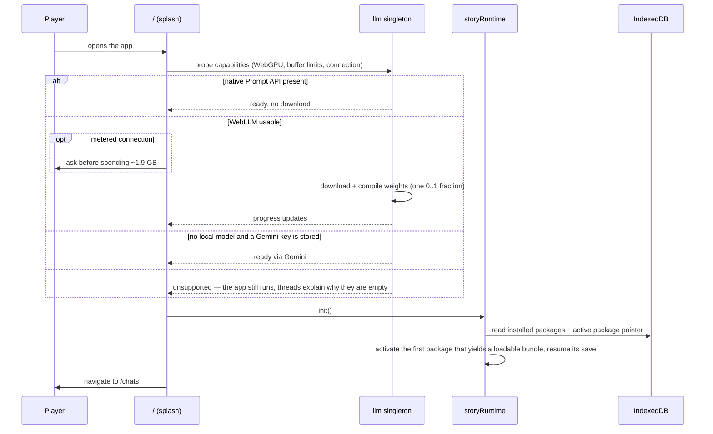
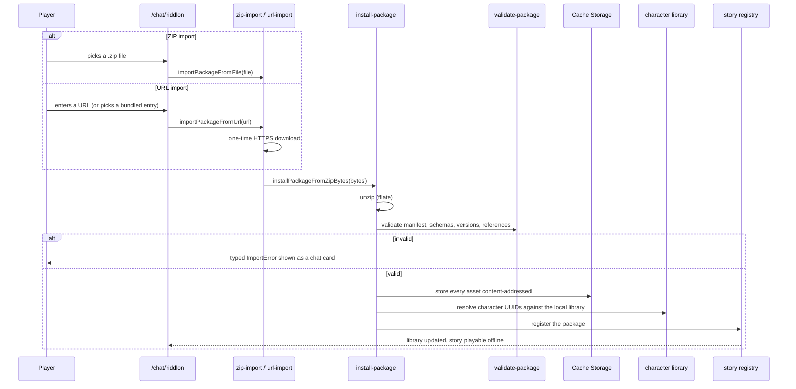
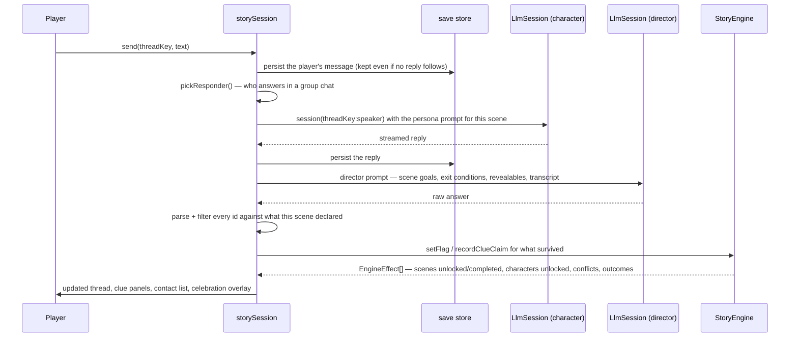
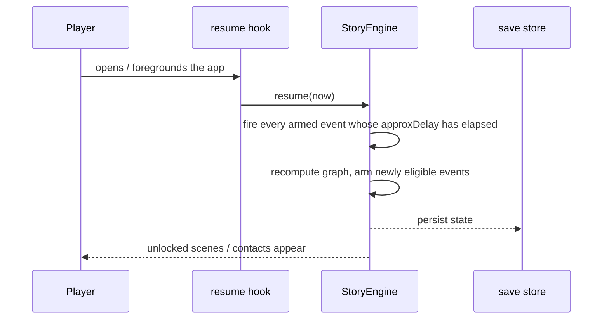
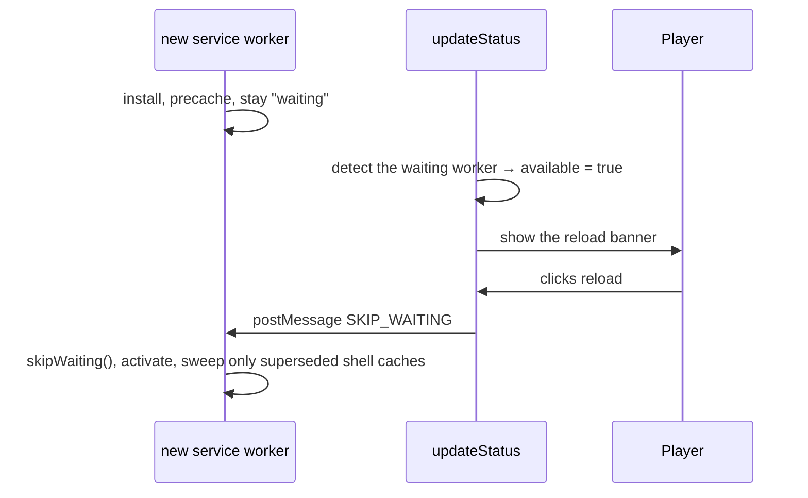

# 6. Runtime View

## 6.1 Boot and First Run

`/` is the splash screen. Its progress bar is derived from real state, not from timers.

Boot phases are `consent → checking → model-load → library-load → done | error`
(`story/boot-steps.ts`). The `loadingModel → preparingDevice` label switch is a threshold heuristic
at 85 % of the load fraction: the backend collapses download and shader compilation into one
fraction, so there is no real phase boundary to read.

A fresh device therefore reaches `/chats` with **an empty chat list** — nothing is auto-installed;
the "Riddlon" system chat is the only row until a package is imported.

## 6.2 Installing a Story Package

Both import paths converge on the same installer. There is no privileged install route: the bundled
example under `static/stories/` is installed through the very same URL importer a player would use
for a third-party package.

The installer never throws; every failure mode is a distinguishable `ImportError`. After import the
story is fully local and independent of where it came from.

## 6.3 One Conversation Turn

This is the core loop. A player turn costs **two** decode passes: the character reply, then the
director verdict.

Details that matter:

- **The persona prompt is rebuilt on every turn.** A thread keeps one session per character for the
  whole story while the _scene_ driving their goals advances underneath it. `createSession(key,
config)` returns the existing session but adopts the new config, destroying and rebuilding the
  backend handle from replayed history. Skipping this made a character replay the goals of the
  scene they were first spoken to in, forever — and since only the director advances the graph, the
  story then stopped dead.
- **The director session is created with `maxHistoryTurns: 0` and destroyed after each call.** It
  must judge this exchange, not accumulate its own past verdicts.
- **The parser is paranoid.** Every id is checked against what the active scene declared, so a
  hallucinated answer can only ever mean "nothing happens", never "some other flag got set". Two
  near-miss shapes a small local model reliably produces — a bare flag id, and a character named by
  display name instead of UUID — are normalised _before_ the allowlist check, never after.
- **A broken stream keeps its partial output.** Whatever was generated before the break is persisted
  rather than dropped.
- **Without a loaded model a thread is empty and says so**, including a scene's opening line, because
  every message is generated. Opening a thread never starts a model download; that is the boot
  screen's decision.

## 6.4 Resume and Delayed Events

Delayed events are persisted due-dates, not timers.

Firing is sticky — a fired event never fires twice. An engine's very first construction is itself a
resume: it unlocks scenes with no entry conditions and arms already-eligible events.

## 6.5 Application Update

A newly installed service worker deliberately sits in the `waiting` state instead of calling
`skipWaiting()` itself, so the open page keeps running the version it loaded.

The activate sweep deletes only `riddlon-shell-*` caches. The asset blob store
(`riddlon-assets-v1`) and the multi-gigabyte model-weight cache are explicitly not swept.

## 6.6 Reset

Two actions behind `/settings`:

| Action                 | Clears                                                                                     | Keeps                                   |
| ---------------------- | ------------------------------------------------------------------------------------------ | --------------------------------------- |
| `resetStoryProgress()` | Savegames                                                                                  | Installed packages, characters, profile |
| `resetEverything()`    | Packages, characters, saves, profile, settings, package assets, the active-package pointer | Downloaded model weights                |

Both end in a full page load, because the state singletons memoise their `init()`.

Model weights survive on purpose: `appKeysToClear()` keeps the `riddlon:llm:*` cache markers, so no
multi-gigabyte re-download is triggered by a factory reset. Two keys are carved out of that rule in
opposite directions — `riddlon:active-package` goes, so no pointer outlives the package the wipe
deleted, and the **Gemini API key goes too** despite sitting under the `riddlon:llm:` prefix: it is a
credential, not a cache, so "alles zurücksetzen" clears it like any other app key.
