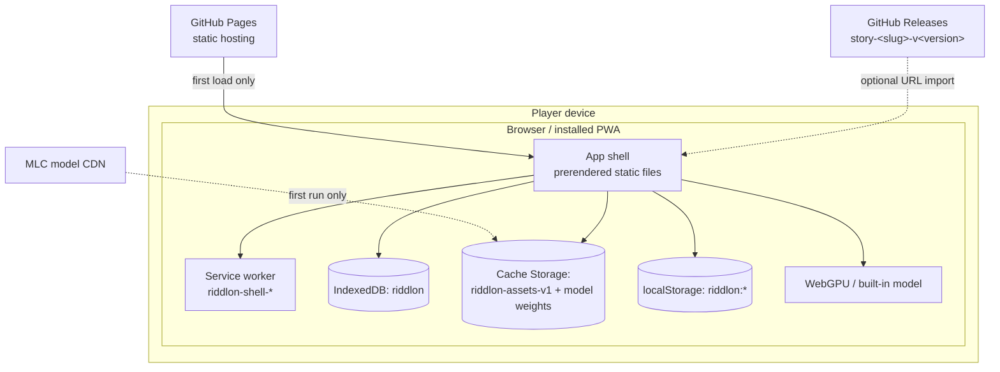

# 7. Deployment View

## 7.1 Runtime Environment

There is exactly one deployment node that runs Riddlon: **the player's browser**.



After the first load and one story import, none of the external nodes is required again.

## 7.2 Application Build and Release

| Step         | Mechanism                                                                                                           |
| ------------ | ------------------------------------------------------------------------------------------------------------------- |
| Build        | `npm run build` → `adapter-static` emits a prerendered shell into `build/`. `prebuild` runs `stories:bundle` first. |
| CI           | `.github/workflows/ci.yml` runs `lint`, `check`, `test` and `build` on every pull request and on `main`.            |
| Versioning   | `.github/workflows/release-please.yml` raises the version/changelog pull request from Conventional Commits.         |
| Deployment   | `.github/workflows/deploy.yml` builds with `BASE_PATH` set to the Pages subpath and publishes on each release.      |
| Dependencies | `.github/workflows/dependabot.yml` opens weekly grouped dependency pull requests with a 7-day cooldown.             |

Two operational notes: release-please needs a `RELEASE_TOKEN` repository secret (a PAT) so a created
release can trigger the deploy workflow, and **Settings → Pages → Source: GitHub Actions** must be
enabled before the first release. `deploy.yml` skips releases tagged `story-*`, so a content release
never redeploys the site.

## 7.3 Story-Package Build and Release

Story content is authored under `stories/<slug>/` — the unzipped package layout, byte for byte,
minus the generated `signatures/checksums.json` — and ships on its own track.

| Command                                                       | Effect                                                                              |
| ------------------------------------------------------------- | ----------------------------------------------------------------------------------- |
| `npm run stories:validate`                                    | Validate every package, write nothing                                               |
| `npm run stories:build`                                       | Validate and write `dist/stories/<slug>-v<version>.zip`                             |
| `npm run stories:bundle`                                      | The same zips plus `index.json` into `static/stories/` (run by `predev`/`prebuild`) |
| `npm run story:playtest -- stories/<slug> [walkthrough.json]` | Replay a scripted walkthrough through the real engine                               |

`scripts/build-stories.mjs` validates through the app's own
`src/lib/content/validate-package.ts`, loaded via Vite's SSR module runner — which is why validating
shipped content needs no separate TypeScript runner and no extra dependency, and why the build step
and the runtime cannot disagree about what a valid package is. On top of the schema it checks what
the schema cannot: undeclared content files and character `avatar` paths that do not resolve.
`npm test` validates every package as well (`src/lib/content/story-packages.spec.ts`), so broken
content fails ordinary CI rather than only the release workflow.

Archives are **reproducible** — fixed timestamps, sorted entries — so an unchanged story rebuilds to
a byte-identical zip with the same `sha256`. `signatures/checksums.json` is generated per build over
the packed files, so a stale copy can never ship.

`static/stories/` is generated and git-ignored; `stories/` stays the only place a story is edited.
Being under `static/` at build time puts the zip into the service worker's precache, which is what
makes the first install work offline.

### Release procedure

`.github/workflows/stories.yml` runs on every pull request and on every push to `main` touching
`stories/**`. On `main` it publishes a GitHub release for each package whose version is not released
yet:

- tag: `story-<slug>-v<version>` (e.g. `story-lucys-portmonnaie-v1.0.0`)
- assets: the `.zip` and its `.sha256`

**Bumping `version` in a package's `manifest.json` and merging to `main` is the entire release
procedure.** Each package releases on its own: editing one story publishes only that story, and
every other package is skipped because its tag already exists.

**A published version is immutable.** Its zip is already installed on players' devices, so the
workflow compares each freshly built checksum against the one attached to the existing release and
fails with "bump the version" on any difference. That turns "I forgot to bump" from a silent
no-publish into a red build. It can only fire on real content changes — an unchanged story rebuilds
byte-identically — so editing a package's `README.md`, which is never packed, does not trip it.

Story versions follow semver against the _story_, not the app: patch for typo and tuning fixes,
minor for added scenes or clues, major for a change that would invalidate an existing savegame.

### Adding a story

1. `mkdir stories/<slug>` and write the package files (see
   [§8.1](./08-crosscutting-concepts.md#81-content-package-format)). `manifest.id` must be a fresh
   UUIDv4 — generate one, never copy another package's.
2. Character UUIDs are stable and global: reuse an existing character's UUID to have the player's
   library recognise them across stories, and mint a new one otherwise.
3. Run `npm run stories:validate` until clean. Optionally add a `walkthrough.json` and run
   `npm run story:playtest -- stories/<slug>` to confirm the graph is actually reachable — the
   validator alone will not tell you that.
4. Open a pull request. CI validates it; merging to `main` releases it.

## 7.4 Local Development

```bash
npm install      # install dependencies (Node 22+)
npm run dev      # dev server on http://localhost:5173, after bundling stories
npm run build    # static site in build/
npm run preview  # serve the production build locally
```

| Task                | Command                                              |
| ------------------- | ---------------------------------------------------- |
| Type-check          | `npm run check`                                      |
| Unit tests          | `npm test` (once) / `npm run test:unit` (watch)      |
| Single test file    | `npx vitest run src/lib/story/story-display.spec.ts` |
| Single test by name | `npx vitest run -t "storyThreads"`                   |
| Lint                | `npm run lint`                                       |
| Format              | `npm run format`                                     |

The service worker is never registered in dev (`vite.config.ts` sets `serviceWorker.register:
false`, and `+layout.svelte` actively unregisters leftovers), so a cache-first worker from an earlier
production load can never mask fresh dev output.
